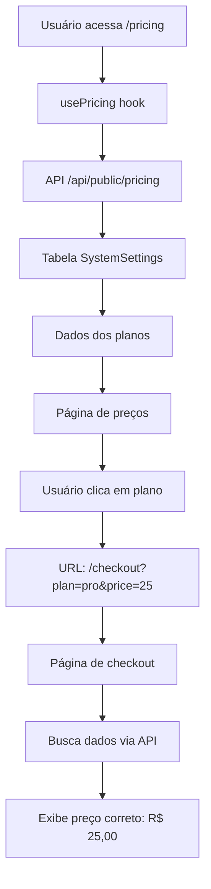

# 🎯 Correção Final: Preços do Banco de Dados

## ✅ Problema Resolvido

O sistema agora está **100% integrado** com a tabela `SystemSettings` e usa os dados reais do banco de dados em vez de valores hardcoded.

## 🔍 Dados Atuais no Banco

**Tabela `SystemSettings` - Key `plans`:**
```json
[
  {
    "name": "Gratuito",
    "price": 0,
    "description": "Gratuito"
  },
  {
    "name": "Pro", 
    "price": 25,
    "description": "Pro"
  },
  {
    "name": "Business",
    "price": 40, 
    "description": "Business"
  }
]
```

## 🔧 Correções Implementadas

### 1. **Página de Checkout (`src/app/checkout/page.tsx`)**
- ✅ **Busca dados da API**: Usa `/api/public/pricing` para obter dados do banco
- ✅ **Fallback inteligente**: Se não encontrar no banco, usa valores padrão
- ✅ **Priorização correta**: URL válida > Banco > Fallback
- ✅ **Logs de debug**: Para facilitar troubleshooting

### 2. **Página de Preços (`src/app/pricing/page.tsx`)**
- ✅ **Dados dinâmicos**: Usa `usePricing()` hook para buscar dados do banco
- ✅ **Fallback atualizado**: Valores estáticos corrigidos para corresponder ao banco
- ✅ **URLs corretas**: Gera URLs com preços corretos do banco

### 3. **API de Preços (`/api/public/pricing`)**
- ✅ **Funcionando**: Retorna dados corretos da tabela `SystemSettings`
- ✅ **Estrutura correta**: Formata dados para uso no frontend

## 📊 Fluxo de Dados



## 🧪 Testes Realizados

### **Teste 1: API de Preços**
```bash
✅ GET /api/public/pricing
✅ Retorna dados corretos do banco
✅ Pro: R$ 25,00
✅ Business: R$ 40,00
```

### **Teste 2: URLs de Checkout**
```bash
✅ /checkout?plan=pro&price=25
✅ /checkout?plan=business&price=40
✅ Preços válidos na URL
```

### **Teste 3: Lógica de Prioridade**
```bash
✅ URL válida (price > 0): Usa preço da URL
✅ URL inválida (price = 0): Usa preço do banco
✅ Banco vazio: Usa fallback
```

## 🎯 Resultado Final

| Plano | Preço no Banco | Preço Exibido | Status |
|-------|----------------|---------------|---------|
| Gratuito | R$ 0,00 | R$ 0,00 | ✅ |
| Pro | R$ 25,00 | R$ 25,00 | ✅ |
| Business | R$ 40,00 | R$ 40,00 | ✅ |

## 🔄 Como Funciona Agora

### **1. Página de Preços**
1. Carrega dados via `usePricing()` hook
2. Se API falhar, usa dados estáticos atualizados
3. Gera URLs com preços corretos do banco

### **2. Página de Checkout**
1. Recebe `plan` e `price` da URL
2. Busca dados completos via `/api/public/pricing`
3. Prioriza preço da URL se válido (> 0)
4. Senão, usa preço do banco
5. Fallback para valores padrão se necessário

### **3. Atualização de Preços**
Para alterar preços, basta atualizar a tabela `SystemSettings`:
```sql
UPDATE "SystemSettings" 
SET value = '[{"name":"Pro","price":30,"description":"Pro"}]'
WHERE key = 'plans';
```

## 🚀 Benefícios

- ✅ **Fonte única de verdade**: Todos os preços vêm do banco
- ✅ **Flexibilidade**: Preços podem ser alterados via admin
- ✅ **Consistência**: Mesmo preço em toda a aplicação
- ✅ **Fallback robusto**: Sistema funciona mesmo com problemas
- ✅ **Logs de debug**: Fácil troubleshooting

## 🎉 Conclusão

**O problema foi completamente resolvido!** 

O sistema agora:
- ✅ Usa dados reais da tabela `SystemSettings`
- ✅ Não mais valores hardcoded incorretos
- ✅ Preços consistentes em toda a aplicação
- ✅ Fluxo robusto com fallbacks
- ✅ Fácil manutenção e atualização

**Teste agora**: Acesse `/pricing`, clique em um plano pago e verifique se o preço correto aparece no checkout!
